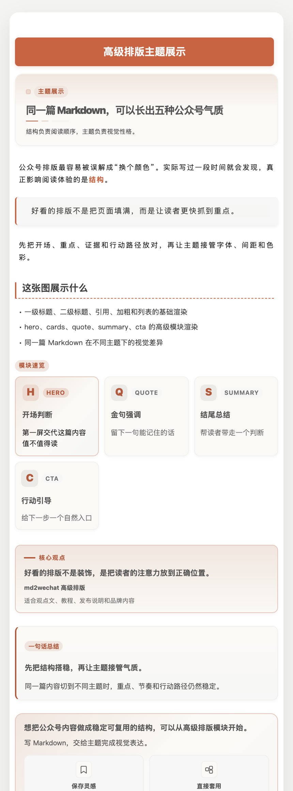
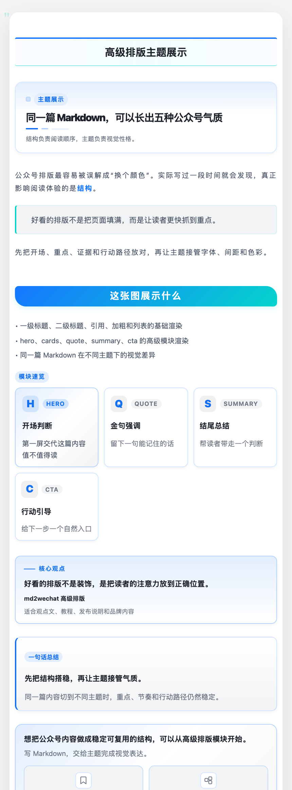
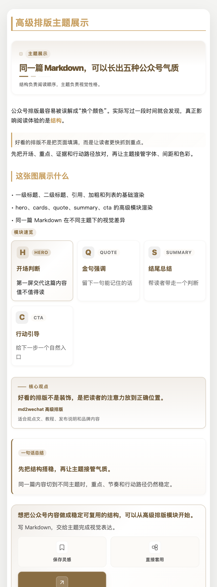

<div align="center">

<h1>
  
  md2wechat
</h1>


**面向 AI Agent 的微信公众号创作与发布 CLI**

写 Markdown，生成公众号排版，制作封面和文章配图，预览校验后推送草稿箱。

支持 Claude Code、Codex、WorkBuddy、Kimi Work、Hermes Agent、OpenClaw 等 Agent 通过 JSON discovery 稳定调用。

[](https://golang.org)
[](LICENSE)
[](https://github.com/geekjourneyx/md2wechat-skill/releases)
[](#agent-工作流)
[](#专业-api)

[快速开始](#快速开始) · [专业 API](#专业-api) · [Agent 工作流](#agent-工作流) · [高级排版](#高级排版) · [文档](#文档)

</div>

---

## 这个项目解决什么问题

md2wechat 把公众号发布流程拆成一组可验证的 CLI 命令：

| 场景 | md2wechat 提供 |
|---|---|
| Markdown 转微信 HTML | `convert`，支持预览、上传图片、创建草稿 |
| 发布前检查 | `inspect --json` 输出标题、摘要、图片、cover、draft readiness |
| 稳定排版 | API 模式返回确定性 HTML，支持 48 个主题和 43 个高级排版模块 |
| Agent 自动化 | `capabilities`、`doctor`、`themes`、`layout`、`providers` 等 discovery 命令 |
| 内容生产 | `write`、`humanize`、`generate_cover`、`generate_infographic` |
| 多账号发布 | 命名公众号账号，本地只读发现，不输出 Secret |
| 微信白名单 | 高级 API 服务可提供微信接口固定出口能力 |

---

## 快速开始

```bash
npm install -g @geekjourneyx/md2wechat
md2wechat config init
```

确认文章状态：

```bash
md2wechat inspect article.md --json
md2wechat preview article.md
```

转换并创建微信草稿：

```bash
md2wechat convert article.md --draft --cover cover.jpg
```

安装方式、微信凭证和 IP 白名单配置见：

- [安装指南](docs/INSTALL.md)
- [微信凭证与 IP 白名单指南](docs/WECHAT-CREDENTIALS.md)
- [配置保姆级指南](docs/CONFIG-WALKTHROUGH.md)

---

## 专业 API

API 模式适合需要稳定输出、多人协作、批量发布或 Agent 自动化的场景。

| 能力 | 免费 AI 模式 | 专业 API 模式 |
|---|---|---|
| 输出方式 | 生成 prompt，由外部 LLM 继续处理 | 直接返回微信 HTML |
| 主题 | 3 个基础主题 | 48 个专业主题 |
| 高级排版模块 | 不支持 | 43 个 `:::module` 模块 |
| 输出一致性 | 取决于外部 LLM | 同样输入得到同样输出 |
| 响应速度 | 取决于外部 LLM | 秒级 |
| 发布自动化 | 适合实验 | 适合团队、客户号、矩阵号 |

专业能力包括：

- 48 个微信渲染精调主题：[theme-gallery](https://md2wechat.app/theme-gallery)
- 43 个高级排版模块：[docs/LAYOUT.md](docs/LAYOUT.md)
- 多公众号账号：[docs/CONFIG.md](docs/CONFIG.md)
- 微信接口固定出口：[docs/WECHAT-CREDENTIALS.md](docs/WECHAT-CREDENTIALS.md)
- 发布前 readiness 检查：[docs/DISCOVERY.md](docs/DISCOVERY.md)

申请 API 服务：关注公众号「极客杰尼」，备注「API咨询」。

<p align="center">

</p>

---

## Agent 工作流

md2wechat 给 Agent 提供可机读接口，减少猜测和误操作。

```bash
md2wechat capabilities --json
md2wechat doctor --json
md2wechat inspect article.md --json
md2wechat themes list --json
md2wechat layout list --json
md2wechat skills list --json
md2wechat skills read md2wechat --json
```

这些命令适合 Claude Code、Codex、WorkBuddy、Kimi Work、Hermes Agent、OpenClaw 以及其他能调用本地 CLI 的 Agent 使用。

Agent 可以据此判断：

- 当前 CLI 支持哪些命令
- API、草稿、上传是否具备执行条件
- 某篇文章能不能发草稿
- 当前主题和排版模块是否可用
- 当前二进制内置的 Agent SOP 是什么

Brand Profile 支持把长期风格偏好写入 `~/.config/md2wechat/brand.md`，由 Agent 在写作和排版时读取。详见 [docs/BRAND-PROFILE.md](docs/BRAND-PROFILE.md)。

---

## 图片生成

md2wechat 支持两条图片路径。

直接调用图片 provider：

```bash
md2wechat generate_cover --article article.md
md2wechat generate_infographic --article article.md --preset infographic-comparison
```

支持 Volcengine、ModelScope、OpenRouter、OpenAI、Gemini 等服务。配置见 [docs/IMAGE_PROVISIONERS.md](docs/IMAGE_PROVISIONERS.md)。

使用宿主 Agent 的 Image Gen：

```bash
md2wechat generate_cover --article article.md --plan --json
md2wechat generate_infographic --article article.md --plan --json
```

计划模式返回 `IMAGE_PLAN_READY`，不请求图片 provider，不要求 `IMAGE_API_KEY`，也不会上传到微信。适合 Codex、WorkBuddy、Kimi Work、Hermes Agent 等运行时已经暴露 Image Gen 工具的 Agent。详见 [docs/AGENT_IMAGE_GEN.md](docs/AGENT_IMAGE_GEN.md)。

---

## 高级排版

API 模式支持 `:::module` 语法，用 Markdown 写结构化公众号排版。

```markdown
:::hero
eyebrow: 深度观察
title: AI 时代的公众号写作
subtitle: 为什么读者愿意继续读下去
:::

:::callout
高级排版模块只在 API 模式渲染。
:::
```

查看和验证模块：

```bash
md2wechat layout list --json
md2wechat layout show hero --json
md2wechat layout validate --file article.md --json
```

<p align="center">



</p>

完整教程见 [docs/LAYOUT.md](docs/LAYOUT.md)。

---

## 常用命令

| 命令 | 用途 |
|---|---|
| `inspect` | 检查文章元数据和发布 readiness |
| `preview` | 本地预览，不上传、不创建草稿 |
| `convert` | Markdown 转微信 HTML，可选创建草稿 |
| `write` | 从想法生成文章 |
| `humanize` | 重写 AI 文章，支持 `authentic` 强度 |
| `generate_cover` | 生成封面图或图片计划 |
| `generate_infographic` | 生成信息图或图片计划 |
| `upload_image` | 上传图片到微信素材库 |
| `config wechat-accounts` | 查看本地多公众号账号配置 |
| `doctor` | 本地配置体检 |

---

## 文档

| 文档 | 内容 |
|---|---|
| [QUICKSTART](docs/QUICKSTART.md) | 新手主路径 |
| [USAGE](docs/USAGE.md) | 命令完整说明 |
| [DISCOVERY](docs/DISCOVERY.md) | Agent discovery 契约 |
| [LAYOUT](docs/LAYOUT.md) | 43 个高级排版模块 |
| [HUMANIZE](docs/HUMANIZE.md) | AI 去痕与 authentic 写作 |
| [AGENT_IMAGE_GEN](docs/AGENT_IMAGE_GEN.md) | 宿主 Agent Image Gen 工作流 |
| [CONFIG](docs/CONFIG.md) | 配置字段和环境变量 |
| [FAQ](docs/FAQ.md) | 常见问题 |
| [TROUBLESHOOTING](docs/TROUBLESHOOTING.md) | 故障排查 |

---

## 许可与商业使用

本项目采用 Source Available License。个人使用、学习、评估、非营利使用免费。商业使用、SaaS、客户交付、白标、再分发和训练数据用途需要商业授权。

商业授权和 API 服务：关注公众号「极客杰尼」备注「API咨询」，或联系 `skrphper@gmail.com`。

---

<div align="center">

[文档](docs) · [Issues](https://github.com/geekjourneyx/md2wechat-skill/issues) · [Commercial licensing](mailto:skrphper@gmail.com)

Made by [geekjourneyx](https://jieni.ai)

</div>
